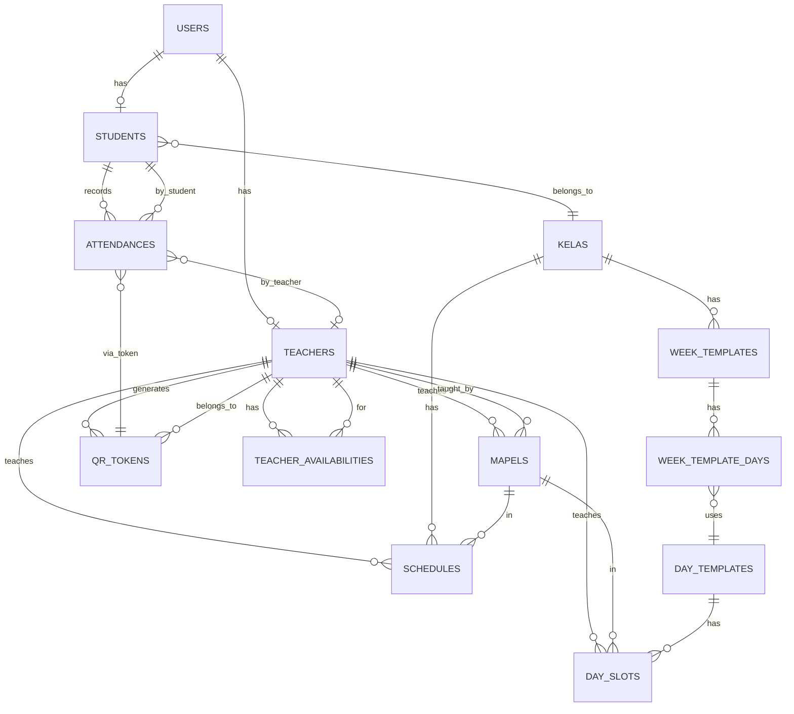

# Entity Relationship Diagram (ERD)
## AbsenQR - Sistem Absensi dengan QR Code

Generated: December 1, 2025

## Diagram Relasi (Text Format)

```
┌──────────────────────────────────────────────────────────────┐
│                          USERS                               │
├──────────────────────────────────────────────────────────────┤
│ id (PK)                                                       │
│ name                                                          │
│ email (UNIQUE)                                                │
│ password                                                      │
│ role (admin | guru | siswa)                                  │
│ related_id (FK → students.id OR teachers.id)                │
│ created_at, updated_at                                       │
└──────────────────────────────────────────────────────────────┘
        │                                                    │
        │ 1:1 (role='siswa')                                │ 1:1 (role='guru')
        │ related_id→students.id                            │ related_id→teachers.id
        ↓                                                    ↓
┌──────────────────────────┐                    ┌──────────────────────────┐
│      STUDENTS            │                    │       TEACHERS           │
├──────────────────────────┤                    ├──────────────────────────┤
│ id (PK)                  │                    │ id (PK)                  │
│ nis (UNIQUE)             │                    │ nip (UNIQUE)             │
│ name                     │                    │ name                     │
│ email                    │                    │ email                    │
│ kelas_id (FK)            │─────────┐          │ created_at, updated_at   │
│ photo                    │         │          └──────────────────────────┘
│ created_at, updated_at   │         │                       │
└──────────────────────────┘         │          ┌────────────┼────────────┐
        │                            │          │            │            │
        │ 1:many                     │ 1:many   │ 1:many     │ 1:many     │ 1:many
        │ attendances               │ schedules│ mapels     │ day_slots  │ qr_tokens
        │                            │          │            │            │
        ↓                            ↓          ↓            ↓            ↓
┌──────────────────────────┐  ┌──────────────────────────────────┐  ┌──────────────┐
│     ATTENDANCES          │  │        SCHEDULES                 │  │  QR_TOKENS   │
├──────────────────────────┤  ├──────────────────────────────────┤  ├──────────────┤
│ id (PK)                  │  │ id (PK)                          │  │ id (PK)      │
│ student_id (FK)          │→─│ kelas_id (FK)                    │  │ teacher_id   │
│ teacher_id (FK)          │→─│ teacher_id (FK)     ◄────────────┼──┼→ (FK)        │
│ absent_at                │  │ mapel_id (FK)                    │  │ token        │
│ status (Hadir|Terlambat) │  │ subject                          │  │ date         │
│ device, ip               │  │ day (Monday...)                  │  │ created_at   │
│ lat, lng                 │  │ start_time                       │  │ updated_at   │
│ token                    │  │ end_time                         │  └──────────────┘
│ created_at, updated_at   │  │ week_type (1|2)                 │         ↑
└──────────────────────────┘  │ room, topic                      │         │
        ↑                      │ created_at, updated_at           │         │ belongs_to
        │                      └──────────────────────────────────┘         │
        │ belongs_to                    ↑                                   │
        │ (student_id)                  │                                   │
        │                               │ belongs_to                       │
        │                               │ (teacher_id, kelas_id, mapel_id) │
        │                               │                                   │
        │            ┌──────────────────┴────────────┬───────────────────┐
        │            │                               │                   │
        │            ↓                               ↓                   ↓
        │      ┌──────────────┐          ┌──────────────────┐      ┌──────────────┐
        │      │    KELAS     │          │      MAPELS      │      │  DAY_SLOTS   │
        │      ├──────────────┤          ├──────────────────┤      ├──────────────┤
        │      │ id (PK)      │          │ id (PK)          │      │ id (PK)      │
        │      │ name         │          │ name             │      │ day_template │
        │      │ room         │          │ code             │      │ mapel_id     │
        │      │ capacity     │          │ teacher_id (FK)  │      │ teacher_id   │
        │      │ created_at   │          │ created_at       │      │ start_time   │
        │      └──────────────┘          └──────────────────┘      │ end_time     │
        │            ↑                                              │ slot_order   │
        │            │                                              │ topic        │
        │ 1:many     │                                              │ created_at   │
        │ students   │                                              └──────────────┘
        │            │                                                      ↑
        └────────────┘                                            │ belongs_to
                                                                   │ (day_template_id,
                                                                   │  mapel_id,
                                                                   │  teacher_id)
                                                                   │
                                                    ┌──────────────┴────────────┐
                                                    │                           │
                                              ┌─────┴────────┐          ┌──────┴─────────┐
                                              │              │          │                │
                                         ┌────┴────────┐ ┌──┴─────┐ ┌─┴──────────┐
                                         │ DAY_TEMPLATES│ │ MAPELS │ │  TEACHERS  │
                                         └──────────────┘ └────────┘ └────────────┘
                                              ↑
                                              │ 1:many
                                              │ day_slots
                                              │
                                    ┌─────────┴──────────────┐
                                    │                        │
                              ┌─────┴──────┐          ┌──────┴────────┐
                              │ WEEK_TEMPLATE_DAYS   │  TEACHER_      │
                              │                      │ AVAILABILITIES │
                              │ id (PK)              │ ├──────────────┤
                              │ week_template_id     │ │ id (PK)      │
                              │ day_name             │ │ teacher_id   │
                              │ day_template_id      │ │ date         │
                              │ day_order            │ │ is_absent    │
                              └──────────────────────┘ │ note         │
                                    ↑                  │ created_at   │
                                    │                  │ updated_at   │
                              1:many│                  └──────────────┘
                                    │                        ↑
                                    │                        │
                              ┌─────┴──────┐           belongs_to
                              │ WEEK_       │           (teacher_id)
                              │TEMPLATES    │
                              ├─────────────┤                │
                              │ id (PK)     │                │
                              │ kelas_id    │                │
                              │ name        │                │
                              │ week_type   │          ┌─────┴──────────────┐
                              │ created_at  │          │    TEACHERS        │
                              └─────────────┘          │                    │
                                    ↑                  │ (Already shown)    │
                                    │                  └────────────────────┘
                              1:many│
                                    │
                              belongs_to
                              (kelas_id)
```

## Relasi Utama (Summary)

| Source | Target | Type | Cardinality | Foreign Key |
|--------|--------|------|-------------|-------------|
| USERS | STUDENTS | 1:1 | role='siswa' | related_id |
| USERS | TEACHERS | 1:1 | role='guru' | related_id |
| STUDENTS | KELAS | Many:1 | - | kelas_id |
| STUDENTS | ATTENDANCES | 1:Many | - | student_id |
| TEACHERS | SCHEDULES | 1:Many | - | teacher_id |
| TEACHERS | MAPELS | 1:Many | - | teacher_id |
| TEACHERS | QR_TOKENS | 1:Many | - | teacher_id |
| TEACHERS | DAY_SLOTS | 1:Many | - | teacher_id |
| TEACHERS | TEACHER_AVAILABILITIES | 1:Many | - | teacher_id |
| KELAS | SCHEDULES | 1:Many | - | kelas_id |
| KELAS | WEEK_TEMPLATES | 1:Many | - | kelas_id |
| MAPELS | SCHEDULES | 1:Many | - | mapel_id |
| MAPELS | DAY_SLOTS | 1:Many | - | mapel_id |
| SCHEDULES | ATTENDANCES | - | via token | - |
| QR_TOKENS | ATTENDANCES | Many:1 | via token | teacher_id |
| WEEK_TEMPLATES | WEEK_TEMPLATE_DAYS | 1:Many | - | week_template_id |
| WEEK_TEMPLATE_DAYS | DAY_TEMPLATES | Many:1 | - | day_template_id |
| DAY_TEMPLATES | DAY_SLOTS | 1:Many | - | day_template_id |
| ATTENDANCES | STUDENTS | Many:1 | - | student_id |
| ATTENDANCES | TEACHERS | Many:1 | - | teacher_id |

## Unique Constraints

```sql
-- QrTokens: One token per teacher per date
UNIQUE KEY unique_teacher_date (teacher_id, date)

-- TeacherAvailabilities: One availability record per teacher per date
UNIQUE KEY unique_teacher_date (teacher_id, date)

-- Students: Unique NIS
UNIQUE KEY nis (nis)

-- Teachers: Unique NIP
UNIQUE KEY nip (nip)

-- Users: Unique Email
UNIQUE KEY email (email)

-- QrTokens: Unique Token
UNIQUE KEY token (token)
```

## Cascade Rules

| Table | Foreign Key | Cascade Rule | Reason |
|-------|-------------|--------------|--------|
| students | kelas_id | ON DELETE CASCADE | Remove students if class deleted |
| attendances | student_id | ON DELETE CASCADE | Remove attendance if student deleted |
| attendances | teacher_id | ON DELETE SET NULL | Preserve attendance history if teacher deleted |
| schedules | kelas_id | ON DELETE CASCADE | Remove schedules if class deleted |
| schedules | teacher_id | ON DELETE CASCADE | Remove schedules if teacher deleted |
| schedules | mapel_id | ON DELETE SET NULL | Preserve schedule if subject deleted |
| mapels | teacher_id | ON DELETE CASCADE | Remove subjects if teacher deleted |
| qr_tokens | teacher_id | ON DELETE CASCADE | Remove tokens if teacher deleted |
| day_slots | day_template_id | ON DELETE CASCADE | Remove slots if template deleted |
| day_slots | teacher_id | ON DELETE SET NULL | Preserve slot if teacher deleted |
| day_slots | mapel_id | ON DELETE SET NULL | Preserve slot if subject deleted |
| week_templates | kelas_id | ON DELETE CASCADE | Remove templates if class deleted |
| week_template_days | week_template_id | ON DELETE CASCADE | Remove days if template deleted |
| week_template_days | day_template_id | ON DELETE SET NULL | Preserve if day template deleted |
| teacher_availabilities | teacher_id | ON DELETE CASCADE | Remove availability if teacher deleted |

## Mermaid ERD (Alternative Format)



## Notes

1. **USERS-STUDENTS/TEACHERS Relationship**: One-to-one, controlled by role field
   - If role='siswa', related_id points to students.id
   - If role='guru', related_id points to teachers.id

2. **ATTENDANCES-TEACHERS Link**: Via QR_TOKENS
   - When student scans QR or inputs token, attendance.teacher_id is set to QR_TOKEN.teacher_id
   - Ensures attendance is associated with correct teacher

3. **Schedule Flexibility**:
   - Primary system: WeekTemplate → WeekTemplateDay → DayTemplate → DaySlot
   - Alternative: Direct Schedule table entries
   - week_type (1 or 2) allows alternate schedules

4. **Teacher Availability**:
   - New table: TEACHER_AVAILABILITIES
   - One record per (teacher_id, date) combination
   - is_absent flag determines if "Guru tidak tersedia" is shown to students

5. **QR Token Management**:
   - One token per (teacher_id, date) combination
   - Token is displayed as QR code for students to scan
   - Linking attendance to teacher_id ensures per-teacher monitoring

6. **Cascade Strategy**:
   - Hard deletes cascade to dependent records (e.g., delete class → delete schedules)
   - Soft deletes use SET NULL to preserve historical data (e.g., delete teacher → preserve attendance)

---

**Last Updated:** December 1, 2025
**Version:** 1.0
**Database:** MySQL 5.7+
